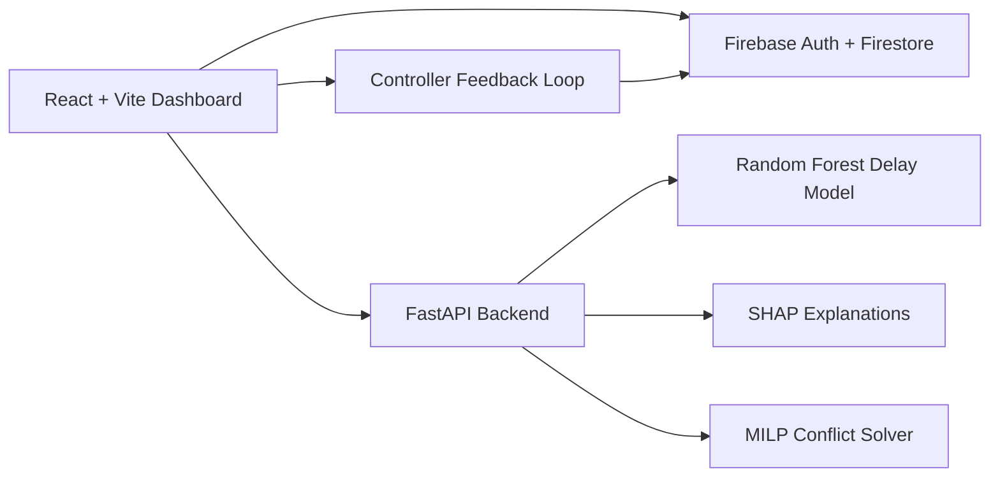

# TrackMind AI

<p align="center">
  
  
  
  
  
</p>

<p align="center">
  Real-time railway operations intelligence for live train tracking, conflict detection, delay prediction, and controller-facing recommendations.
</p>

<p align="center">
  <strong>Live corridor visibility</strong> · <strong>Conflict-aware recommendations</strong> · <strong>Explainable delay prediction</strong>
</p>

TrackMind AI is a full-stack railway monitoring platform built for section-level visibility. It combines a live React dashboard, Firebase-backed operational data, and a FastAPI ML backend to help surface train conflicts, predict delays, and explain why recommendations are being made.

## Why It Exists

Railway control views often answer only part of the problem: where trains are, not what is likely to happen next.

TrackMind AI focuses on that missing layer by combining:

- operational visibility
- predictive delay scoring
- conflict-aware recommendations
- controller feedback loops

## Overview

TrackMind AI is designed around one practical use case: helping operators understand what is happening inside a corridor right now.

It brings together:

- live train block visualization across `B1` to `B12`
- delay prediction with explanation output
- conflict detection and action suggestions
- analytics for train health, conflict history, and controller feedback
- Firebase-backed state for trains, conflicts, recommendations, and feedback

## Feature Snapshot

### Live Operations

- Real-time train panel with delay, speed, block, and status
- Parallel train detail viewing for large train lists
- Block map with corridor-wide occupancy and conflict indicators
- AI recommendations tied to current conflict conditions

### Analytics

- Delay trend chart with rolling tick history
- Conflict resolution history with controller approval context
- RL-style action approval summaries
- Block occupancy and severity breakdowns

### AI / Backend

- Random Forest delay prediction
- SHAP-based explanation output
- Batch and live prediction routes
- MILP-based conflict resolution support
- RL feedback capture for recommendation quality

## At a Glance

| Area | What You Get |
|---|---|
| Operations | Live train map, conflict visibility, train drill-downs |
| Intelligence | Delay prediction, SHAP reasoning, ranked recommendations |
| Analytics | Trend charts, conflict history, feedback summaries |
| Platform | Firebase auth/data layer with FastAPI ML services |

## Tech Stack

| Layer | Tools |
|---|---|
| Frontend | React, TypeScript, Vite, Tailwind, Recharts |
| Backend | FastAPI, scikit-learn, SHAP, PuLP, pandas |
| Data | Firestore |
| Auth | Firebase Authentication |
| Runtime | Node.js + Python |

## Architecture



## Project Structure

```text
trackmind-ai/
├── backend/                 # FastAPI backend, ML models, training and seeding scripts
├── public/                  # Static assets
├── src/components/          # Dashboard and analytics UI components
├── src/pages/               # Landing, login, dashboard, analytics
├── src/lib/                 # Firebase setup and API clients
├── src/utils/               # Conflict, prediction, feedback, seeding helpers
├── firebase.json
├── firestore.rules
└── package.json
```

## Core Views

### Dashboard

- live section KPIs
- train status and detail drawer
- conflict panel
- AI recommendation panel
- operational notifications
- full live line map

### Analytics

- delay trend visualization
- conflict history timeline
- RL dashboard summary
- performance breakdown charts

## Experience Highlights

- modern corridor-wide live line map
- controller-friendly parallel detail viewing
- conflict counts and recommendations derived from live train positions
- analytics that surface both operational state and model behavior

## Workflow

1. Trains are read from Firestore and shown in the live corridor map.
2. The backend predicts delay risk using the current station or inferred route position.
3. Conflicts are detected from train placement and surfaced in operator views.
4. Recommendations are ranked and shown with confidence plus estimated delay savings.
5. Controller feedback is stored and reused in analytics and RL-style summaries.

## API Surface

### Prediction

- `POST /predict-delay`
- `POST /predict-delay/batch`
- `POST /predict-delay/live-batch`

### Operations

- `POST /resolve-conflict`
- `GET /train-route/{train_number}`

### Monitoring

- `GET /health`
- `GET /model-info`
- `GET /stats`
- `GET /top-delayed`
- `GET /station-stats/{station_code}`

## Quick Start

### 1. Install frontend dependencies

```bash
npm install
```

### 2. Configure environment

Create a `.env` file in the repo root:

```env
VITE_FIREBASE_API_KEY=...
VITE_FIREBASE_AUTH_DOMAIN=...
VITE_FIREBASE_PROJECT_ID=...
VITE_FIREBASE_STORAGE_BUCKET=...
VITE_FIREBASE_MESSAGING_SENDER_ID=...
VITE_FIREBASE_APP_ID=...
VITE_FIREBASE_MEASUREMENT_ID=...
VITE_API_URL=http://localhost:8000
```

### 3. Install backend dependencies

```bash
cd backend
python3 -m venv venv
source venv/bin/activate
pip install -r requirements.txt
```

### 4. Run the backend

```bash
cd backend
uvicorn main:app --reload
```

Backend URL: [http://localhost:8000](http://localhost:8000)

### 5. Run the frontend

```bash
npm run dev
```

Frontend URL: [http://localhost:5173](http://localhost:5173)

## Development Commands

### Frontend

```bash
npm run dev
npm run build
npm run preview
npm run lint
```

### Backend

```bash
cd backend
uvicorn main:app --reload
python3 train_rf.py
python3 train_rl.py
python3 seed_station_codes.py
```

## Model + Data Notes

- trained Random Forest artifacts live in `backend/models/`
- training and prep scripts live in:
  - `backend/prepare_data.py`
  - `backend/train_rf.py`
  - `backend/train_rl.py`
- explanation logic lives in `backend/xai_explainer.py`

## Firebase Notes

- Firestore stores trains, conflicts, recommendations, RL feedback, and bookings
- Firebase Auth handles login
- some views include local fallbacks when Firestore seed data or quota is incomplete

## Operational Notes

- if Firestore quota is exceeded, reseeding flows may temporarily fail
- the UI includes a visual full-corridor fallback when train data is compressed into half the corridor
- large assets may trigger Vite bundle-size warnings during production build

## Verification

### Frontend build

```bash
npm run build
```

### Backend syntax check

```bash
python3 -m py_compile backend/main.py
```

## Repository

[hardikdhingra150/trackrail](https://github.com/hardikdhingra150/trackrail)
